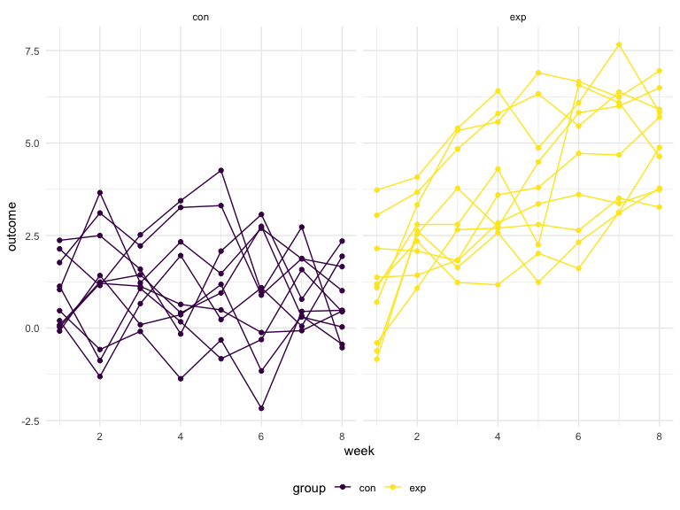

Homework 5
================
Jia Ji
2022-11-16

### Problem 0

``` r
library(tidyverse)
```

## Problem 1

The code chunk below imports the data in individual spreadsheets
contained in `./data/zip_data/`. To do this, I create a dataframe that
includes the list of all files in that directory and the complete path
to each file. As a next step, I `map` over paths and import data using
the `read_csv` function. Finally, I `unnest` the result of `map`.

``` r
full_df = 
  tibble(
    files = list.files("data/zip_data/"),
    path = str_c("data/zip_data/", files)
  ) %>% 
  mutate(data = map(path, read_csv)) %>% 
  unnest()
```

    ## Rows: 1 Columns: 8
    ## ── Column specification ────────────────────────────────────────────────────────
    ## Delimiter: ","
    ## dbl (8): week_1, week_2, week_3, week_4, week_5, week_6, week_7, week_8
    ## 
    ## ℹ Use `spec()` to retrieve the full column specification for this data.
    ## ℹ Specify the column types or set `show_col_types = FALSE` to quiet this message.
    ## Rows: 1 Columns: 8
    ## ── Column specification ────────────────────────────────────────────────────────
    ## Delimiter: ","
    ## dbl (8): week_1, week_2, week_3, week_4, week_5, week_6, week_7, week_8
    ## 
    ## ℹ Use `spec()` to retrieve the full column specification for this data.
    ## ℹ Specify the column types or set `show_col_types = FALSE` to quiet this message.
    ## Rows: 1 Columns: 8
    ## ── Column specification ────────────────────────────────────────────────────────
    ## Delimiter: ","
    ## dbl (8): week_1, week_2, week_3, week_4, week_5, week_6, week_7, week_8
    ## 
    ## ℹ Use `spec()` to retrieve the full column specification for this data.
    ## ℹ Specify the column types or set `show_col_types = FALSE` to quiet this message.
    ## Rows: 1 Columns: 8
    ## ── Column specification ────────────────────────────────────────────────────────
    ## Delimiter: ","
    ## dbl (8): week_1, week_2, week_3, week_4, week_5, week_6, week_7, week_8
    ## 
    ## ℹ Use `spec()` to retrieve the full column specification for this data.
    ## ℹ Specify the column types or set `show_col_types = FALSE` to quiet this message.
    ## Rows: 1 Columns: 8
    ## ── Column specification ────────────────────────────────────────────────────────
    ## Delimiter: ","
    ## dbl (8): week_1, week_2, week_3, week_4, week_5, week_6, week_7, week_8
    ## 
    ## ℹ Use `spec()` to retrieve the full column specification for this data.
    ## ℹ Specify the column types or set `show_col_types = FALSE` to quiet this message.
    ## Rows: 1 Columns: 8
    ## ── Column specification ────────────────────────────────────────────────────────
    ## Delimiter: ","
    ## dbl (8): week_1, week_2, week_3, week_4, week_5, week_6, week_7, week_8
    ## 
    ## ℹ Use `spec()` to retrieve the full column specification for this data.
    ## ℹ Specify the column types or set `show_col_types = FALSE` to quiet this message.
    ## Rows: 1 Columns: 8
    ## ── Column specification ────────────────────────────────────────────────────────
    ## Delimiter: ","
    ## dbl (8): week_1, week_2, week_3, week_4, week_5, week_6, week_7, week_8
    ## 
    ## ℹ Use `spec()` to retrieve the full column specification for this data.
    ## ℹ Specify the column types or set `show_col_types = FALSE` to quiet this message.
    ## Rows: 1 Columns: 8
    ## ── Column specification ────────────────────────────────────────────────────────
    ## Delimiter: ","
    ## dbl (8): week_1, week_2, week_3, week_4, week_5, week_6, week_7, week_8
    ## 
    ## ℹ Use `spec()` to retrieve the full column specification for this data.
    ## ℹ Specify the column types or set `show_col_types = FALSE` to quiet this message.
    ## Rows: 1 Columns: 8
    ## ── Column specification ────────────────────────────────────────────────────────
    ## Delimiter: ","
    ## dbl (8): week_1, week_2, week_3, week_4, week_5, week_6, week_7, week_8
    ## 
    ## ℹ Use `spec()` to retrieve the full column specification for this data.
    ## ℹ Specify the column types or set `show_col_types = FALSE` to quiet this message.
    ## Rows: 1 Columns: 8
    ## ── Column specification ────────────────────────────────────────────────────────
    ## Delimiter: ","
    ## dbl (8): week_1, week_2, week_3, week_4, week_5, week_6, week_7, week_8
    ## 
    ## ℹ Use `spec()` to retrieve the full column specification for this data.
    ## ℹ Specify the column types or set `show_col_types = FALSE` to quiet this message.
    ## Rows: 1 Columns: 8
    ## ── Column specification ────────────────────────────────────────────────────────
    ## Delimiter: ","
    ## dbl (8): week_1, week_2, week_3, week_4, week_5, week_6, week_7, week_8
    ## 
    ## ℹ Use `spec()` to retrieve the full column specification for this data.
    ## ℹ Specify the column types or set `show_col_types = FALSE` to quiet this message.
    ## Rows: 1 Columns: 8
    ## ── Column specification ────────────────────────────────────────────────────────
    ## Delimiter: ","
    ## dbl (8): week_1, week_2, week_3, week_4, week_5, week_6, week_7, week_8
    ## 
    ## ℹ Use `spec()` to retrieve the full column specification for this data.
    ## ℹ Specify the column types or set `show_col_types = FALSE` to quiet this message.
    ## Rows: 1 Columns: 8
    ## ── Column specification ────────────────────────────────────────────────────────
    ## Delimiter: ","
    ## dbl (8): week_1, week_2, week_3, week_4, week_5, week_6, week_7, week_8
    ## 
    ## ℹ Use `spec()` to retrieve the full column specification for this data.
    ## ℹ Specify the column types or set `show_col_types = FALSE` to quiet this message.
    ## Rows: 1 Columns: 8
    ## ── Column specification ────────────────────────────────────────────────────────
    ## Delimiter: ","
    ## dbl (8): week_1, week_2, week_3, week_4, week_5, week_6, week_7, week_8
    ## 
    ## ℹ Use `spec()` to retrieve the full column specification for this data.
    ## ℹ Specify the column types or set `show_col_types = FALSE` to quiet this message.
    ## Rows: 1 Columns: 8
    ## ── Column specification ────────────────────────────────────────────────────────
    ## Delimiter: ","
    ## dbl (8): week_1, week_2, week_3, week_4, week_5, week_6, week_7, week_8
    ## 
    ## ℹ Use `spec()` to retrieve the full column specification for this data.
    ## ℹ Specify the column types or set `show_col_types = FALSE` to quiet this message.
    ## Rows: 1 Columns: 8
    ## ── Column specification ────────────────────────────────────────────────────────
    ## Delimiter: ","
    ## dbl (8): week_1, week_2, week_3, week_4, week_5, week_6, week_7, week_8
    ## 
    ## ℹ Use `spec()` to retrieve the full column specification for this data.
    ## ℹ Specify the column types or set `show_col_types = FALSE` to quiet this message.
    ## Rows: 1 Columns: 8
    ## ── Column specification ────────────────────────────────────────────────────────
    ## Delimiter: ","
    ## dbl (8): week_1, week_2, week_3, week_4, week_5, week_6, week_7, week_8
    ## 
    ## ℹ Use `spec()` to retrieve the full column specification for this data.
    ## ℹ Specify the column types or set `show_col_types = FALSE` to quiet this message.
    ## Rows: 1 Columns: 8
    ## ── Column specification ────────────────────────────────────────────────────────
    ## Delimiter: ","
    ## dbl (8): week_1, week_2, week_3, week_4, week_5, week_6, week_7, week_8
    ## 
    ## ℹ Use `spec()` to retrieve the full column specification for this data.
    ## ℹ Specify the column types or set `show_col_types = FALSE` to quiet this message.
    ## Rows: 1 Columns: 8
    ## ── Column specification ────────────────────────────────────────────────────────
    ## Delimiter: ","
    ## dbl (8): week_1, week_2, week_3, week_4, week_5, week_6, week_7, week_8
    ## 
    ## ℹ Use `spec()` to retrieve the full column specification for this data.
    ## ℹ Specify the column types or set `show_col_types = FALSE` to quiet this message.
    ## Rows: 1 Columns: 8
    ## ── Column specification ────────────────────────────────────────────────────────
    ## Delimiter: ","
    ## dbl (8): week_1, week_2, week_3, week_4, week_5, week_6, week_7, week_8
    ## 
    ## ℹ Use `spec()` to retrieve the full column specification for this data.
    ## ℹ Specify the column types or set `show_col_types = FALSE` to quiet this message.

The result of the previous code chunk isn’t tidy – data are wide rather
than long, and some important variables are included as parts of others.
The code chunk below tides the data using string manipulations on the
file, converting from wide to long, and selecting relevant variables.

``` r
tidy_df = 
  full_df %>% 
  mutate(
    files = str_replace(files, ".csv", ""),
    group = str_sub(files, 1, 3)) %>% 
  pivot_longer(
    week_1:week_8,
    names_to = "week",
    values_to = "outcome",
    names_prefix = "week_") %>% 
  mutate(week = as.numeric(week)) %>% 
  select(group, subj = files, week, outcome)
```

Finally, the code chunk below creates a plot showing individual data,
faceted by group.

``` r
tidy_df %>% 
  ggplot(aes(x = week, y = outcome, group = subj, color = group)) + 
  geom_point() + 
  geom_path() + 
  facet_grid(~group)
```



This plot suggests high within-subject correlation – subjects who start
above average end up above average, and those that start below average
end up below average. Subjects in the control group generally don’t
change over time, but those in the experiment group increase their
outcome in a roughly linear way.

## Problem 2

``` r
homicide_df = read_csv("https://raw.githubusercontent.com/washingtonpost/data-homicides/master/homicide-data.csv") %>%  mutate(city_state = str_c(city,", ",state)) %>% 
  select(uid,city_state,everything()) 
```

    ## Rows: 52179 Columns: 12
    ## ── Column specification ────────────────────────────────────────────────────────
    ## Delimiter: ","
    ## chr (9): uid, victim_last, victim_first, victim_race, victim_age, victim_sex...
    ## dbl (3): reported_date, lat, lon
    ## 
    ## ℹ Use `spec()` to retrieve the full column specification for this data.
    ## ℹ Specify the column types or set `show_col_types = FALSE` to quiet this message.

``` r
homicide_df <- homicide_df %>%
  mutate(city_state = str_c(city, state, sep = ", "),
         resolution = case_when(
           disposition == "Closed without arrest" ~ "unsolved",
           disposition == "Open/No arrest" ~ "unsolved",
           disposition == "Closed by arrest" ~ "solved")) %>%
  relocate(city_state) %>%
  filter(city_state != "Tulsa, AL")
```

Filter to Baltimore

``` r
baltimore_df <- homicide_df %>%
  filter(city_state == "Baltimore, MD")
baltimore_summary <- baltimore_df %>%
  summarise(
    unsolved = sum(resolution == "unsolved"),
    n = n()
  )
baltimore_test <- prop.test(
  x = baltimore_summary %>% pull(unsolved),
  n = baltimore_summary %>% pull(n)
)
baltimore_test %>%
  broom::tidy()
```

    ## # A tibble: 1 × 8
    ##   estimate statistic  p.value parameter conf.low conf.high method        alter…¹
    ##      <dbl>     <dbl>    <dbl>     <int>    <dbl>     <dbl> <chr>         <chr>  
    ## 1    0.646      239. 6.46e-54         1    0.628     0.663 1-sample pro… two.si…
    ## # … with abbreviated variable name ¹​alternative

Table of unsolved and total murders for each city

``` r
homicide_df %>%
  group_by(city_state) %>%
  summarise(
    unsolved = sum(resolution == "unsolved"),
    n = n()) %>%
  knitr::kable(col.names = c("City", "Unsolved Murders", "Total Murders"))
```

| City               | Unsolved Murders | Total Murders |
|:-------------------|-----------------:|--------------:|
| Albuquerque, NM    |              146 |           378 |
| Atlanta, GA        |              373 |           973 |
| Baltimore, MD      |             1825 |          2827 |
| Baton Rouge, LA    |              196 |           424 |
| Birmingham, AL     |              347 |           800 |
| Boston, MA         |              310 |           614 |
| Buffalo, NY        |              319 |           521 |
| Charlotte, NC      |              206 |           687 |
| Chicago, IL        |             4073 |          5535 |
| Cincinnati, OH     |              309 |           694 |
| Columbus, OH       |              575 |          1084 |
| Dallas, TX         |              754 |          1567 |
| Denver, CO         |              169 |           312 |
| Detroit, MI        |             1482 |          2519 |
| Durham, NC         |              101 |           276 |
| Fort Worth, TX     |              255 |           549 |
| Fresno, CA         |              169 |           487 |
| Houston, TX        |             1493 |          2942 |
| Indianapolis, IN   |              594 |          1322 |
| Jacksonville, FL   |              597 |          1168 |
| Kansas City, MO    |              486 |          1190 |
| Las Vegas, NV      |              572 |          1381 |
| Long Beach, CA     |              156 |           378 |
| Los Angeles, CA    |             1106 |          2257 |
| Louisville, KY     |              261 |           576 |
| Memphis, TN        |              483 |          1514 |
| Miami, FL          |              450 |           744 |
| Milwaukee, wI      |              403 |          1115 |
| Minneapolis, MN    |              187 |           366 |
| Nashville, TN      |              278 |           767 |
| New Orleans, LA    |              930 |          1434 |
| New York, NY       |              243 |           627 |
| Oakland, CA        |              508 |           947 |
| Oklahoma City, OK  |              326 |           672 |
| Omaha, NE          |              169 |           409 |
| Philadelphia, PA   |             1360 |          3037 |
| Phoenix, AZ        |              504 |           914 |
| Pittsburgh, PA     |              337 |           631 |
| Richmond, VA       |              113 |           429 |
| Sacramento, CA     |              139 |           376 |
| San Antonio, TX    |              357 |           833 |
| San Bernardino, CA |              170 |           275 |
| San Diego, CA      |              175 |           461 |
| San Francisco, CA  |              336 |           663 |
| Savannah, GA       |              115 |           246 |
| St. Louis, MO      |              905 |          1677 |
| Stockton, CA       |              266 |           444 |
| Tampa, FL          |               95 |           208 |
| Tulsa, OK          |              193 |           583 |
| Washington, DC     |              589 |          1345 |

Iterate across cities First, write a prop.test function and test on a
sample city

``` r
prop_test_function <- function(city_df) {
  
  city_summary <- city_df %>%
  summarise(
    unsolved = sum(resolution == "unsolved"),
    n = n()
  )
  city_test <- prop.test(
    x = city_summary %>% pull(unsolved),
    n = city_summary %>% pull(n))
  return(city_test)
}
prop_test_function(baltimore_df)
```

    ## 
    ##  1-sample proportions test with continuity correction
    ## 
    ## data:  city_summary %>% pull(unsolved) out of city_summary %>% pull(n), null probability 0.5
    ## X-squared = 239.01, df = 1, p-value < 2.2e-16
    ## alternative hypothesis: true p is not equal to 0.5
    ## 95 percent confidence interval:
    ##  0.6275625 0.6631599
    ## sample estimates:
    ##         p 
    ## 0.6455607

Now iterate across all cities

``` r
results_df <- homicide_df %>%
  nest(data = uid:resolution) %>%
  mutate(
    test_results = map(data, prop_test_function),
    tidy_results = map(test_results, broom::tidy)
  ) %>%
  select(city_state, tidy_results) %>%
  unnest(tidy_results) %>%
  select(city_state, estimate, starts_with("conf"))
```

Plot of estimates and error bars for each city

``` r
results_df %>%
  mutate(city_state = fct_reorder(city_state, estimate)) %>%
  ggplot(aes(x = city_state, y = estimate)) +
  geom_point() +
  geom_errorbar(aes(ymin = conf.low, ymax = conf.high)) +
  theme(axis.text.x = element_text(angle = 90, vjust = 0.5, hjust = 1)) +
  xlab("City, State") +
  ylab("Proportion of Murders that are Unsolved") +
  ggtitle("Estinated Proportion of Murders which are Unsolved by City")
```


\## Problem 3

``` r
samples <- rerun(5000,rnorm(n = 30,mean = 0,sd = 5))
t_test <- function(mu = 0) {
  sample <- tibble(rnorm(n = 30, mean = mu, sd = 5))
  
  result <- t.test(sample) %>% 
    broom::tidy() %>% 
    select(estimate,p.value)
  
  result
}
t_test()
```

    ## # A tibble: 1 × 2
    ##   estimate p.value
    ##      <dbl>   <dbl>
    ## 1    -1.39   0.139

Test

``` r
mean_0 <- expand_grid(mean = 0, iteration = 1:5000) %>% 
  mutate(result = map(mean,t_test)) %>% 
  unnest(result)
head(mean_0)
```

    ## # A tibble: 6 × 4
    ##    mean iteration estimate p.value
    ##   <dbl>     <int>    <dbl>   <dbl>
    ## 1     0         1   0.446   0.612 
    ## 2     0         2   1.76    0.0509
    ## 3     0         3   0.131   0.896 
    ## 4     0         4  -1.28    0.130 
    ## 5     0         5   0.0139  0.987 
    ## 6     0         6  -0.804   0.478

``` r
mean_multi <- expand_grid(mean = 1:6, iteration = 1:5000) %>% 
  mutate(result = map(mean,t_test)) %>% 
  unnest(result)
head(mean_multi)
```

    ## # A tibble: 6 × 4
    ##    mean iteration estimate p.value
    ##   <int>     <int>    <dbl>   <dbl>
    ## 1     1         1    0.838  0.345 
    ## 2     1         2    1.01   0.389 
    ## 3     1         3    1.99   0.0598
    ## 4     1         4    2.25   0.0211
    ## 5     1         5    0.324  0.613 
    ## 6     1         6    1.52   0.0467

Plots

``` r
mean_multi %>%
  group_by(mean) %>% 
  summarize(proportion_rejected = sum(p.value < 0.05)/5000) %>% 
  ggplot(aes(x = mean,y = proportion_rejected)) +
  scale_x_continuous(limits = c(1,6), breaks = seq(1,6,1)) + 
  geom_point() + geom_path() +
  labs(x = "True Mean",y = "Power ( proportion of rejected tests )",title = "Power of t.test with different means")
```


``` r
mean_multi %>%
  group_by(mean) %>% 
  summarize(average_estimate = mean(estimate,na.rm = T)) %>% 
  ggplot(aes(x = mean,y = average_estimate)) +
  scale_x_continuous(limits = c(1,6), breaks = seq(1,6,1)) + 
  geom_point() + geom_path() +
  labs(x = "True Mean",y = "Average Estimate Mean",title = "Estimated Means")
```


``` r
rejected_estimate <- mean_multi %>% 
  filter(p.value < 0.05) %>% group_by(mean) %>% 
  summarize(average_estimate = mean(estimate,na.rm = T)) %>% 
  ungroup()
full_estimate <- mean_multi %>% 
  group_by(mean) %>% 
  summarize(average_estimate = mean(estimate,na.rm = T)) %>% 
  ungroup()
  
ggplot(full_estimate,aes(x = mean, y = average_estimate)) +
  geom_line(data = full_estimate,aes(colour = "blue")) +
  geom_line(data = rejected_estimate,aes(colour = "red")) +
  scale_color_manual(name = " ", values = c("blue" = "blue", "red" = "red"),
                     labels = c('All Estimates','Rejected Estimates'))+
  geom_point(data = full_estimate,colour = "blue") +
  geom_point(data = rejected_estimate,colour = "red") +
  scale_x_continuous(limits = c(1,6), breaks = seq(1,6,1)) +
  labs(x = "True Mean",y = "Average Estimate Mean",title = "All vs. Rejected Estimates")
```


